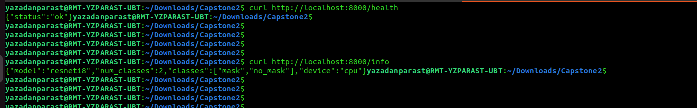
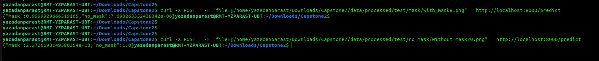
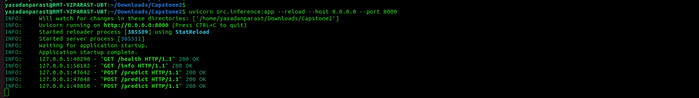

# Face Mask Image Classification – Capstone 2 (ML Zoomcamp)


## 🎯 Problem Description

Monitoring compliance with face mask regulations in public and industrial
environments is typically done manually by human operators or security staff.
This approach is expensive, does not scale well, and is prone to human error,
especially in crowded or continuous-monitoring scenarios.

This project addresses the problem by building an **automated image-based
classification system** that determines whether a person in an image is
wearing a face mask or not.

## 👤 Target Users

The model is designed to be used by:

- Organizations responsible for **public safety enforcement**
- **Facility operators** (airports, factories, hospitals, campuses)
- **Developers and ML engineers** integrating computer vision models into
  monitoring or surveillance pipelines


## 🧠 Decision Supported by the Model

Given an input image containing a human face, the model predicts whether
the person is wearing a face mask or not.

This prediction supports automated decisions such as:
- Triggering alerts when mask compliance is violated
- Logging compliance statistics over time
- Enabling downstream workflows in monitoring systems


## 💡 Why This Problem Matters

Manual monitoring of mask usage:
- Does not scale to large or continuous environments
- Is costly and labor-intensive
- Can miss violations due to fatigue or human error

An automated face mask detection system enables:
- Scalable real-time monitoring
- Consistent and objective enforcement
- Integration into existing computer vision systems

This makes the solution valuable in both **public health** and
**industrial safety** contexts.


The system is built end-to-end using **deep learning**, **API-based inference**,
**containerization**, and **Kubernetes orchestration**.

This project is developed as **Capstone 2** for the **Machine Learning Zoomcamp**.

---

## 🎯 Business Context
Automatically detecting mask usage can help:
- Enforce safety regulations in public or industrial environments
- Reduce manual monitoring costs
- Enable scalable, automated compliance systems

The model can be integrated into surveillance pipelines or image-based monitoring systems.

---

## 🗂️ Dataset Description

The dataset consists of labeled images of human faces collected for the task
of face mask classification.This dataset contains a total of 20,347 images belonging to the 2 classes.

Each image belongs to one of two classes:
- `mask` – the person is wearing a face mask
- `no_mask` – the person is not wearing a face mask

The dataset includes variations in:
- Lighting conditions
- Face orientations
- Mask types
- Background environments

---

### Dataset Source

The dataset is based on publicly available face mask image datasets
commonly used for computer vision classification tasks.

Example sources include:
- Kaggle Face Mask Detection datasets
- Public GitHub image repositories

The dataset is used strictly for educational and research purposes.


---

### Dataset Exploration

Exploratory data analysis (EDA) is performed in `notebook.ipynb`, including:
- Class distribution analysis
- Visual inspection of sample images
- Identification of potential data quality issues

The notebook focuses on understanding the dataset rather than production training.

---


### 📦 Dataset Access

Due to the size of the dataset, it is **not included** in this repository.

To reproduce the results, download the dataset from one of the following
public sources and place it in the `data/raw` directory:

- Face Mask Detection Dataset  
  https://data.mendeley.com/datasets/7bt2d592b9

- The dataset is split into train, validation, and test sets using a
reproducible stratified split (70/15/15) implemented in `src/preprocessing.py`.
- Split statistics are logged for transparency and reproducibility.

After downloading, organize the dataset as follows:

---

### Dataset structure:
```css
The dataset is organized into training and validation splits:

data/processed/
├── train/
│ ├── mask/
│ └── no_mask/
├── val/
│ ├── mask/
│ └── no_mask/
├── test/
│ ├── mask/
│ └── no_mask/


The notebook and training scripts expect this directory structure.(We split train/validation 80/20.)
```

## 🧠 Solution Overview

This project implements an **end-to-end deep learning system** for automated
face mask image classification, covering the full machine learning lifecycle
from data exploration to production deployment.

The solution consists of the following components:

1. **Data Exploration & Validation**  
   - Exploratory data analysis is performed in `notebook.ipynb`
   - Class balance, image quality, and sample diversity are inspected
   - The notebook is used only for analysis and experimentation

2. **Model Training**  
   - A convolutional neural network based on **ResNet18** is trained using
     transfer learning
   - Input images are resized to **224×224** and normalized
   - The model predicts probabilities for two classes: `mask` and `no_mask`
   - Training and validation logic is implemented in standalone scripts

3. **Inference Service**  
   - The trained model is served through a **FastAPI** application
   - A REST endpoint (`POST /predict`) accepts an image and returns class
     probabilities
   - The service is stateless and suitable for horizontal scaling

4. **Containerization & Deployment**  
   - The inference service is packaged into a Docker container
   - The container is deployed on a local **Kubernetes (kind)** cluster
   - A Kubernetes Deployment ensures high availability with multiple replicas
   - A NodePort Service exposes the API for external access

5. **Autoscaling & Monitoring**  
   - **Horizontal Pod Autoscaling (HPA)** dynamically adjusts the number of pods
     based on CPU utilization
   - Prediction outputs are logged for monitoring
   - **Evidently** is used to analyze prediction distributions and detect
     potential data drift

6. **Configuration & Reproducibility**  
   - Model and training parameters are managed via YAML configuration files
   - Dependencies are managed using `uv` and pinned in `requirements.txt`
   - The entire system can be reproduced using the provided scripts and manifests

This architecture demonstrates production-ready machine learning practices,
including modular code, containerized inference, Kubernetes orchestration,
autoscaling, and monitoring.

---

## 🚀 Development
The source code follows a `src/`-based layout. The `src` directory is treated
as a Python package to ensure clean imports and compatibility with testing,
Docker, and CI environments.

---

## 🧠 Model
- Architecture: **ResNet18 (transfer learning)**
- Loss function: Cross-Entropy Loss
- Optimizer: Adam
- Output: Probability of `mask` vs `no_mask`

---

`Images are resized to **224×224** and normalized during preprocessing.`


---

## 📓 Exploratory Data Analysis (Notebook)
The notebook file (`notebook.ipynb`) includes:
- Dataset size inspection
- Visual inspection of sample images
- Image transformations
- Baseline CNN training
- Evaluation metrics (classification report, confusion matrix)

> The `notebook.ipynb` file is used **only for exploration and validation**.  
> Final training and inference are implemented in standalone scripts.

---


## 🚀 Inference Service
The trained model is exposed via a **FastAPI REST API**.


##  Endpoint(POST /predict)

### Example Request
```bash
curl -X POST \
  -F "file=@image.jpg" \
  http://localhost:30008/predict
```

### Example Response
```json
{
  "mask": 0.87,
  "no_mask": 0.13
}
```


## 🐳 Containerization

The inference service is containerized using Docker.

To build the image:

```bash
docker build -t face-mask .
```
---

## ☸️ Kubernetes Deployment (kind)

The system is deployed on a local Kubernetes cluster using kind.

Kubernetes resources:

- Namespace
- Deployment (replicas > 1)
- NodePort Service

To deploy:

```bash
kind create cluster --name face-mask
docker build -t face-mask .
kind load docker-image face-mask --name face-mask

kubectl apply -f k8s/
```
---


## ☸️ Kubernetes Autoscaling (HPA)

The inference service is deployed on Kubernetes with
**Horizontal Pod Autoscaling (HPA)** enabled.

The HPA automatically scales the number of running pods based on
CPU utilization, allowing the system to handle varying workloads efficiently.

### Autoscaling Configuration
- Minimum replicas: 2
- Maximum replicas: 6
- Target CPU utilization: 60%

This ensures:
- High availability during traffic spikes
- Efficient resource usage during low traffic
- Improved production readiness

The HPA configuration is defined in:
```
k8s/hpa.yaml
```
---

## ⚙️ Configuration Management (YAML)

Model parameters, training settings, and data paths are managed using
a dedicated YAML configuration file. This avoids hard-coded values
and improves reproducibility and maintainability.

### Usage:

The configuration is loaded at runtime by the training and inference scripts,
allowing easy experimentation and environment-specific overrides without
modifying the code.


### Configuration File
The main configuration file is located at:
```
config/model.yaml
```

Example configuration:

```yaml
model:
  name: resnet18
  num_classes: 2

training:
  batch_size: 32
  epochs: 5
  learning_rate: 0.0001

data:
  image_size: 224
  train_dir: data/train
  val_dir: data/val
```

---

## 📦 Dependency Management

Project dependencies are managed using **uv**, a fast and modern Python
package manager.

Dependencies are declared in `pyproject.toml` and automatically compiled
into a reproducible `requirements.txt` file.

### Adding Dependencies
To add a new dependency:

```bash
uv add torch torchvision fastapi uvicorn pillow numpy evidently pandas
```

### Generating requirements.txt

A pinned `requirements.txt` file is generated automatically:
```bash
uv pip compile pyproject.toml -o requirements.txt
```

The `requirements.txt` file is committed to the repository to ensure
compatibility with standard Python environments and Docker builds.


## 📊 Monitoring

Basic monitoring is implemented by:

- Logging prediction probabilities
- Tracking class distribution over time
- Generating drift analysis reports (optional extension with Evidently)
- Prediction drift is monitored using Evidently.
- Model predictions are logged and periodically compared against a reference
distribution to detect data drift.

## 🧪 Reproducibility

- All dependencies are listed in `requirements.txt`
- Training, inference, and deployment are script-based
- The project can be fully reproduced using the instructions in this `README.md`
- Preprocessing logic is unit-tested to ensure correct dataset structure
and reproducible behavior.

---

## 💻 Deploy on Local and Local Testing

Run the inference service locally:

```bash
uvicorn src.inference:app --reload --host 0.0.0.0 --port 8000
```


Test the inference service health and info locally:
```bash
curl http://localhost:8000/health
curl http://localhost:8000/info
```


Logs of health and info:


Test the inference service predict locally:

```bash
curl -X POST -F "file=@image.jpg" http://localhost:8000/predict
```


Logs of predict:



---

## 🐳 Deploy on Docker

Build the Docker image:

```bash
docker build -t face-mask .
```


Verify the Docker image:
```bash
docker images | grep face-mask
```

Run the container:
```bash
docker run -p 8001:8000 face-mask
```

Test endpoints:
```bash
curl http://localhost:8001/health
curl http://localhost:8001/info
curl -X POST -F "file=@image.jpg" http://localhost:8001/predict
```

Swagger UI:
```bash
http://localhost:8001/docs
```


## 🛠️ Tech Stack

### Machine Learning & Deep Learning
- **PyTorch** – deep learning framework used for model training and inference
- **torchvision** – pre-trained models, image transformations, and datasets
- **NumPy** – numerical computations
- **Pillow (PIL)** – image loading and preprocessing

### API & Inference
- **FastAPI** – high-performance REST API for model inference
- **Uvicorn** – ASGI server for running the FastAPI application

### Experimentation & Monitoring
- **Evidently** – data and prediction drift analysis
- **Pandas** – data manipulation for monitoring and reporting

### Containerization & Orchestration
- **Docker** – containerization of the inference service
- **Kubernetes (kind)** – local Kubernetes cluster for deployment
- **Horizontal Pod Autoscaler (HPA)** – automatic scaling based on CPU usage

### Configuration & Dependency Management
- **YAML** – configuration management for model and training parameters
- **uv** – fast Python dependency management
- **requirements.txt** – pinned dependencies for reproducibility

### Development & Tooling
- **Jupyter Notebook** – exploratory data analysis and experimentation
- **Makefile** – automation of common development tasks
- **Git & GitHub** – version control and project collaboration


---


## 🧱 Project Structure

```css
capstone2-face-mask-k8s/
│
├── config/
│   └── model.yaml
|
├── data/
│   └── .gitkeep
|
├── k8s/
│   ├── deployment.yaml
│   ├── hpa.yaml
|   ├── namespace.yaml
│   └── service.yaml
|
├── logs/
│   └── preprocessing.log
│
├── models/
│   └── model.pt
│
├──monitoring/
|  └── evidently_report.py
|
├── src/
│   ├── __init__.py
│   ├── config.py
│   ├── inference.py
│   ├── model.py
│   ├── monitoring.py
│   ├── preprocessing.py
│   └── train.py
|
├── tests/
│   └── test_preprocessing.py
|
├── .gitattributes
├── Dockerfile
├── main.py
├── Makefile
├── notebook.ipynb
├── pyproject.toml
├── README.md
├── requirements.txt
└── uv.lock

```


## ⚠️ Limitations & Future Work

### Limitations

While the current system demonstrates the feasibility of automated face mask
classification, it has several limitations:

- **Limited dataset diversity**  
  The dataset may not fully represent all real-world conditions such as
  extreme lighting, heavy occlusions, low-resolution surveillance images,
  or uncommon face coverings.

- **Binary classification only**  
  The model distinguishes only between `mask` and `no_mask` and does not
  handle partial compliance cases (e.g., mask worn incorrectly).

- **Static image inference**  
  The system operates on individual images and does not leverage temporal
  information available in video streams.

- **No automated retraining pipeline**  
  Model retraining and updates are currently manual and not triggered by
  detected data drift.

- **Limited fairness analysis**  
  The model has not been evaluated for potential bias across demographic
  groups, which may affect real-world deployment.

---

### Future Work

Potential improvements and extensions include:

- **Dataset expansion and augmentation**  
  Incorporating more diverse images and applying advanced augmentation
  techniques to improve generalization.

- **Multi-class classification**  
  Extending the model to detect incorrect mask usage (e.g., nose uncovered).

- **Video stream support**  
  Integrating the model with real-time video pipelines and temporal smoothing
  for more stable predictions.

- **Automated monitoring and retraining**  
  Adding data drift detection and automated retraining workflows using tools
  such as Evidently and MLflow.

- **Model optimization for edge deployment**  
  Applying model quantization or pruning to enable deployment on edge devices
  with limited computational resources.

- **Fairness and robustness evaluation**  
  Performing systematic evaluations across demographics and environmental
  conditions to ensure responsible deployment.
