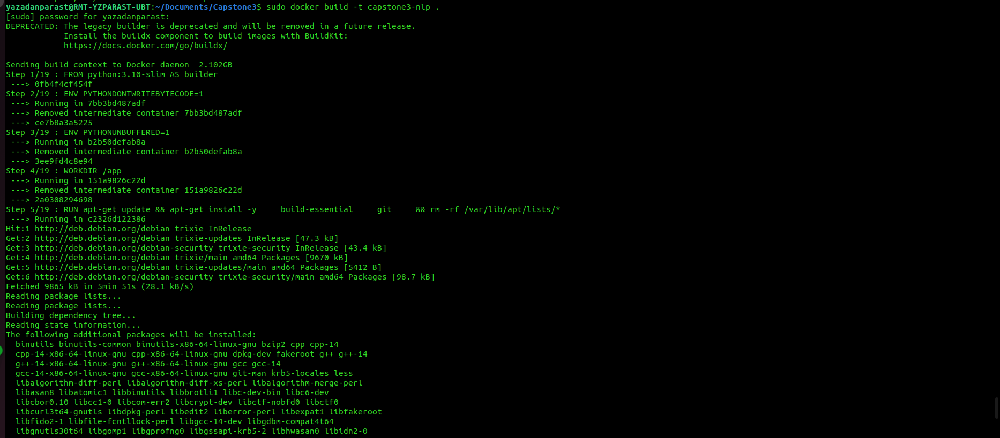

# Fake News Detection – Capstone3 Project (ML Zoomcamp)

## 🎯 Problem Description
The rapid spread of misinformation and fake news through online platforms has become a serious societal challenge. Manual verification of news articles by human fact-checkers is slow, expensive, and does not scale to the massive volume of content produced every day.

This project addresses the problem by building an automated Natural Language Processing (NLP) system that classifies news articles as either **fake** or **real** based on their textual content.

---

## 👤 Target Users
The model is designed to be used by:

- Media organizations and content moderation teams  
- Researchers studying misinformation and media credibility  
- Developers and ML engineers building NLP-based content analysis systems  
- Platforms that require automated pre-screening of textual content  

---

## 🧠 Decision Supported by the Model
Given a news article (title and body text), the model predicts whether the article is **fake** or **real**.

This prediction supports automated decisions such as:

- Flagging potentially fake news for human review  
- Reducing the workload of manual fact-checking teams  
- Enabling downstream workflows in content moderation pipelines  
- Supporting research and analysis of misinformation patterns  

---

## 💡 Why This Problem Matters
Manual fake news detection:

- Does not scale to large volumes of online content  
- Is costly and time-consuming  
- Is prone to subjectivity and human bias  

An automated fake news detection system enables:

- Scalable and consistent content screening  
- Faster identification of suspicious articles  
- Integration into existing NLP and moderation systems  

This makes the solution valuable for both research and real-world content management applications.

The system is built end-to-end using machine learning, API-based inference, containerization, and production-oriented ML engineering practices.

This project is developed as a capstone project for the **Machine Learning Zoomcamp**.

---

## 🎯 Business / Application Context
Automatically detecting fake news can help:

- Reduce the spread of misinformation  
- Assist content moderation and fact-checking workflows  
- Enable scalable analysis of large text corpora  
- Support research into misinformation dynamics  

The model can be integrated into news aggregation systems, moderation tools, or NLP analytics pipelines.

---

## 🗂️ Dataset Description
The dataset consists of labeled news articles collected for the task of fake news detection. Each sample includes textual information such as:

- Article title  
- Article body text  
- Ground-truth label (`fake` or `real`)  

The dataset is designed for binary text classification.

---

Dataset Labels
Each article belongs to one of two classes:

- `fake` – the article contains misinformation or fabricated content  
- `real` – the article is from a reliable or verified source  

The dataset includes variations in:

- Writing styles  
- Article lengths  
- Topics and domains  
- Linguistic patterns  

---

### Dataset Source

The dataset is based on publicly available fake news datasets
commonly used for natural language processing classification tasks.

Example sources include:
- Kaggle Fake and Real News datasets
- Public research datasets and repositories

The dataset is used strictly for educational and research purposes.

---

### 📊 Dataset Exploration
Exploratory Data Analysis (EDA) is performed in `notebooks/eda.ipynb`, including:

- Class distribution analysis  
- Article length statistics  
- Vocabulary inspection  
- Identification of potential data quality issues  

The notebook focuses on understanding the dataset rather than production training.

---


### 📦 Dataset Access

Due to the size of the dataset, it is **not included** in this repository.

To reproduce the results, download the dataset from one of the following
public sources and place it in the `data/raw` directory:

- Fake and Real News Dataset  
  https://www.kaggle.com/datasets/clmentbisaillon/fake-and-real-news-dataset

- The dataset is split into train, validation, and test sets using a
reproducible stratified split (70/15/15) implemented in `src/preprocessing.py`.
- Split statistics are logged for transparency and reproducibility.

After downloading, organize the dataset as follows:

---

### Dataset structure:

The raw dataset consists of two separate files (`fake.csv` and `true.csv`).
During preprocessing, these files are merged, labeled, cleaned, and split
into train, validation, and test sets, which are saved as CSV files under
`data/processed/`.


Each file contains a `text` column representing the news content.

### 🏷 Labeling
- `fake` → label `0`
- `real` → label `1`

### 🧹 Preprocessing Steps
The preprocessing pipeline performs:
- Lowercasing text
- Removing URLs, digits, and punctuation
- Merging fake and real datasets
- Stratified splitting into:
  - **Train**
  - **Validation**
  - **Test**

### 📁 Output Structure
After running:
```bash
python src/preprocessing.py
```
The following files are generated:
```css
data/processed/
├── train.csv
├── val.csv
└── test.csv
```


we can see the preprocessing logs in `logs/preprocessing.log`


The notebook and training scripts expect this directory structure.(We split train/validation/test 70/15/15.)

## 🧠 Solution Overview

This project implements an **end-to-end NLP system** for automated fake news detection, covering the full machine learning lifecycle from data exploration to production deployment.

The solution consists of the following components:

1. **Data Exploration & Validation**  
   - Exploratory data analysis is performed in `notebooks/eda.ipynb`  
   - Class balance, article lengths, and vocabulary diversity are inspected  
   - The notebook is used only for analysis and experimentation

2. **Model Training and Tuning**  
   - A text classification model is trained using **TF-IDF + Logistic Regression** as baseline, with optional transformer upgrade (BERT / DistilBERT)  
   - Article titles and body text are preprocessed (cleaning, tokenization)  
   - The model predicts probabilities for two classes: `fake` and `real`  
   - Training and validation logic is implemented in standalone scripts

3. **Inference Service**  
   - The trained model is served through a **FastAPI** application  
   - A REST endpoint (`POST /predict`) accepts a news article and returns class probabilities  
   - The service is stateless and suitable for horizontal scaling

4. **Containerization & Deployment**  
   - The inference service is packaged into a Docker container  
   - The container can be deployed locally or on a cloud cluster  
   - Deployment ensures high availability and reproducibility  
   - The API is exposed for external access

5. **Monitoring & Analysis**  
   - Prediction outputs and input statistics are logged for monitoring  
   - **Evidently** is used to analyze prediction distributions and detect potential data drift  
   - Input text length, vocabulary coverage, and class distribution are monitored

6. **Configuration & Reproducibility**  
   - Model and training parameters are managed via YAML configuration files  
   - Dependencies are pinned in `pyproject.toml` or `requirements.txt`  
   - The entire system can be reproduced using the provided scripts and manifests

This architecture demonstrates production-ready machine learning practices, including modular code, containerized inference, scalable deployment, monitoring, and reproducibility.

---

## 🚀 Development
The source code follows a `src/`-based layout. The `src` directory is treated
as a Python package to ensure clean imports and compatibility with testing,
Docker, and CI environments.

---

## 📓 Exploratory Data Analysis & Feature Analysis (Notebook)
The notebook file (`notebook.ipynb`) includes:
- Dataset size inspection
- Class distribution analysis
- Text length and vocabulary statistics
- The dataset is split into train, validation, and test sets using a
  reproducible stratified split (70/15/15) implemented in `src/preprocessing.py`.
- Text preprocessing (cleaning, tokenization)
- Baseline model training (TF-IDF + Logistic Regression)
- Evaluation metrics (F1-score, precision, recall, confusion matrix)

> The `notebook.ipynb` file is used **only for exploration and validation**.  
> Final training and inference are implemented in standalone scripts.


---

## 📝 Notebook Overview

This project includes **two separate notebooks** to explore and experiment with different approaches to fake news detection:

1. **TF-IDF + Classical ML Notebook(tfidf_experiments.ipynb)**  
   - Implements baseline models using **TF-IDF text features**.  
   - Experiments with algorithms such as Logistic Regression, Random Forest, and SVM.  
   - Provides **quick insights** on feature importance and baseline performance.  
   - Useful for **understanding dataset structure** and **establishing a benchmark**.

2. **Transformer-based Notebook(bert_exploration.ipynb) (BERT / DistilBERT)**  
   - Implements **state-of-the-art NLP models** using **pretrained Transformers**.  
   - Handles tokenization, sequence length, attention masks, and fine-tuning.  
   - Provides **higher accuracy and more robust predictions** compared to TF-IDF baselines.  
   - Used as the **final production model** for training and inference.

> Having both notebooks allows for **progressive model development**:  
> first exploring simple features and classical ML, then moving to more complex **deep learning approaches** for production-grade performance.

---

## 🧠 TF-IDF vs BERT: Preprocessing Differences

This project includes **two separate notebooks** for text representation and modeling:
- **TF-IDF + Classical ML**
- **BERT (Transformer-based Deep Learning)**

They intentionally use **different preprocessing strategies**, because these models learn language in fundamentally different ways.

---

### 📄 TF-IDF Preprocessing (tfidf_experiments.ipynb)

TF-IDF relies on **explicit word statistics**, so heavier text normalization is required to reduce noise and dimensionality.

**Applied steps:**
- Lowercasing all text
- Removing URLs
- Removing digits and punctuation
- Stripping extra whitespace
- Optional stopword removal and n-grams
- Vectorization using `TfidfVectorizer`

**Why this matters:**
- TF-IDF treats text as a **bag of words**
- Noise directly increases feature space
- Cleaning improves signal-to-noise ratio and model stability

**Best suited for:**
- Linear models (Logistic Regression, SVM)
- Fast experimentation and baselines
- Interpretability (feature importance)

---

### 🤖 BERT Preprocessing (bert_exploration.ipynb)

BERT is pretrained on **raw natural language** and uses **subword tokenization**, so minimal cleaning is applied.

**Applied steps:**
- Lowercasing (handled internally by tokenizer)
- Tokenization using `DistilBertTokenizer`
- Padding and truncation to fixed sequence length
- Attention mask generation

**Not applied:**
- ❌ Stopword removal  
- ❌ Aggressive punctuation removal  
- ❌ Manual token splitting  

**Why this matters:**
- BERT learns **context and syntax**
- Removing words or punctuation can harm meaning
- The tokenizer is optimized for pretrained weights

**Best suited for:**
- Context-aware classification
- Higher accuracy on complex language
- Production-grade NLP systems

---

### 🔍 Why Two Notebooks Are Necessary

| Aspect | TF-IDF | BERT |
|------|-------|------|
| Feature type | Sparse vectors | Dense contextual embeddings |
| Preprocessing | Heavy | Minimal |
| Training speed | Very fast | Slower (GPU preferred) |
| Interpretability | High | Lower |
| Accuracy ceiling | Medium | High |

Keeping these pipelines **separate and explicit**:
- Improves clarity
- Avoids incorrect preprocessing reuse
- Demonstrates understanding of NLP fundamentals
- Makes experimental comparison fair and reproducible

---

### ✅ Takeaway

> **Preprocessing is model-dependent.**  
> Applying TF-IDF cleaning rules to BERT would degrade performance, while using raw text with TF-IDF would introduce noise.

This project deliberately separates both approaches to ensure **correct, principled, and production-ready NLP workflows**.

---

## 🤖 Model Training & Tuning
- Architecture: **DistilBERT (Transformer-based model, transfer learning)**
- Loss function: Cross-Entropy Loss
- Optimizer: AdamW
- Output: Probability of `fake` vs `real`
- Hyperparameters passed to the model via `config/model.py` file

Training Done on google colab to use GPU and we see the GPU `Tesla4` is available:


after that we started the training and it was ok and `model.pt` saved in directory model.


---

Text inputs are tokenized using the **DistilBERT tokenizer**, padded and truncated
to a maximum sequence length (**512 tokens**) during preprocessing.


## 🚀 Inference Service

The trained **Fake News Detection model** is exposed via a **FastAPI REST API**
for real-time inference.

The service loads the trained **Transformer-based text classification model**
and returns **class probabilities** for the labels `fake` and `real`.

---

## 🔌 Endpoint (POST `/predict`)

### Example Request

```bash
curl -X POST http://localhost:8000/predict \
  -H "Content-Type: application/json" \
  -d '{
        "text": "Breaking news: Scientists discover water on Mars."
      }'
```

### Example Response
```json
{
  "fake": 0.91,
  "real": 0.09
}
```
---

## 💻 Deploy Locally & Test Inference

Run the inference service locally using Uvicorn:

```bash
uvicorn src.inference:app --reload --host 0.0.0.0 --port 8000
```


### 🩺 Health & Metadata Endpoints

Verify that the service is running correctly:
```bash
curl http://localhost:8000/health
curl http://localhost:8000/info
```

Example Responses

```json
{ "status": "ok" }
```
```json
{
  "model": "transformer-based fake news classifier",
  "num_classes": 2,
  "classes": ["fake", "real"],
  "device": "cpu"
}
```



Logs of health and info:


### 🔮 Test Prediction Locally

Send a sample text to the model:
```bash
curl -X POST http://localhost:8000/predict \
  -H "Content-Type: application/json" \
  -d '{
        "text": "You will not believe what this politician said next!"
      }'
```

Example Output
```json
{
  "fake": 0.91,
  "real": 0.09
}
```

```bash
curl -X POST -F "file=@image.jpg" http://localhost:8000/predict
```


### 📜 Inference Logs

Prediction requests are logged for monitoring, debugging, and drift analysis.

Logs of predict:


---